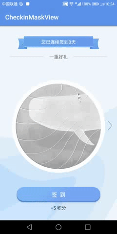

# checkin-mask-view
`Android Bitmap PorterDuffXfermode One of Uses`
`项目还不能直接用 目前只做学习展示`


## Preview


## Core Practice
#### Assemble Bitmaps
```java
public void updateTodayCheckInUI(int convertDay, int mask, List<Integer> waterDrawables) {
        postDelayed(() -> {
            try {
                mSrcWidth = mSrcWidth > 0 ? mSrcWidth : getWidth();
                mSrcHeight = mSrcHeight > 0 ? mSrcHeight : getHeight();
                mSrcBitmap = BitmapHelper.scaleImage(BitmapHelper.decodeResource(getContext(), mask), mSrcWidth, mSrcHeight);
                mMaskBitmap = Bitmap.createBitmap(mSrcWidth, mSrcHeight, Bitmap.Config.ARGB_4444);

                mSrcRect = new Rect(0, 0, mSrcWidth, mSrcHeight);
                mDestRect = new Rect(0, 0, mSrcWidth, mSrcHeight);
                int currDay = convertDay % 9;
                mBeginHeight = mSrcHeight - (currDay <= 4 ? mSrcHeight / (currDay + 2) : 0);

                mCurrentTop = mBeginHeight;
                mDynamicRect = new Rect(0, mBeginHeight, mSrcWidth, mSrcHeight);

                if (convertDay == 9 || convertDay == 18 || convertDay == 27) {
                    invalidate();
                    return;
                }

                // begin compose water bitmaps
                if (waterDrawables.size() > 0) {
                    mWaterBitmap = Bitmap.createBitmap(mSrcWidth, mSrcHeight, Bitmap.Config.ARGB_4444);
                    Bitmap[] bitmaps = new Bitmap[waterDrawables.size()];
                    for (int i = 0; i < bitmaps.length; i++) {
                        bitmaps[i] = BitmapHelper.scaleImage(BitmapHelper.decodeResource(getContext(), waterDrawables.get(i)), mSrcWidth, mSrcHeight);
                    }
                    mWaterBitmap = BitmapHelper.addWatermarks(mWaterBitmap, bitmaps);
                }
                invalidate();
            } catch (OutOfMemoryError e) {
                e.printStackTrace();
            }
        }, 100L);
    }
```

#### Draw Bitmap

```java
 ...
 private Bitmap mMaskBitmap, mSrcBitmap, mWaterBitmap;
 private PorterDuffXfermode srcInMode = new PorterDuffXfermode(PorterDuff.Mode.SRC_IN);
 
 @Override
 protected void onDraw(Canvas canvas) {
      super.onDraw(canvas);
      if (mSrcBitmap == null || mMaskBitmap == null || mComplete)
          return;
      int saveLayerCount = canvas.saveLayer(0, 0, mSrcWidth, mSrcHeight, mBitPaint, Canvas.ALL_SAVE_FLAG);
      // draw mask bitmap & rect
      canvas.drawRect(mDynamicRect, mBitPaint);
      canvas.drawBitmap(mMaskBitmap, mSrcRect, mDestRect, mBitPaint);
      mBitPaint.setXfermode(srcInMode);
      //draw src bitmap
      canvas.drawBitmap(mSrcBitmap, mSrcRect, mDestRect, mBitPaint);
      mBitPaint.setXfermode(null);
      //draw water bitmap
      if (mWaterBitmap != null && !mWaterBitmap.isRecycled())
          canvas.drawBitmap(mWaterBitmap, 0, 0, mBitPaint);
      canvas.restoreToCount(saveLayerCount);
  }
```

#### Start invalidate
```java
    public void start(OnMaskListener onMaskListener) {
        if (mMaskBitmap == null)
            return;
        ValueAnimator translationAnimator = ValueAnimator.ofFloat(mCurrentTop, 0).setDuration(400);
        translationAnimator.addUpdateListener(animation -> {
            float value = (float) animation.getAnimatedValue();
            mDynamicRect.top = (int) value;
            invalidate();
            if (value == 0) {
                if (onMaskListener != null) {
                    onMaskListener.onStartDrawMaskComplete();
                }
            }
        });
        translationAnimator.setDuration(1500);
        translationAnimator.start();
    }
```
